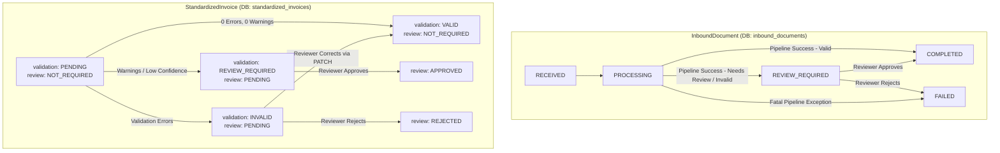

# OneDMS — API Contract & Integration Specification (Person 5 Deliverable)

**Author:** Person 5 (Workflow API, Persistence, and Integration)  
**Target Audience:** Person 1 (Intake/Storage), Person 2 (Extraction/AI), Person 3 (Mapping/Validation/OEM), Person 4 (Frontend/UI)  
**Status:** Published Contract for Hackathon 2026 POC  

---

## 1. Overview & Ownership Boundaries

| Role | Domain / Ownership | Key Interfaces Owned |
|---|---|---|
| **Person 1** | Document Intake & Raw Storage | `POST /api/documents` (upload/API intake), `GET /api/documents/{id}/source` |
| **Person 2** | Extraction & Parsing Engine | `ExtractionService.extract(doc, source_bytes_or_payload) -> ExtractedInvoiceData` |
| **Person 3** | Mapping, Rules & OEM Export | `MappingService.map_to_canonical()`, `ValidationEngine.validate()`, `OEMService.map_to_oem()` |
| **Person 4** | Frontend Dashboard & Reviewer UI | React pages: Document Queue, Invoice Review & Edit, OEM Export Preview |
| **Person 5** (Us) | Workflow Orchestration, Repositories, APIs & Persistence | `GET/POST /api/documents`, `POST /api/documents/{id}/process`, `GET/PATCH /api/invoices`, `POST /api/invoices/{id}/review`, `GET /api/invoices/{id}/mock-oem`, Health |

---

## 2. API Paths & Endpoint Matrix

All paths are under the prefix `/api` (unversioned, matching existing backend convention):

| Method | Endpoint | Description | Owned By |
|---|---|---|---|
| `GET` | `/api/health/` | Quick liveness probe (independent, 0 token spend) | Person 5 |
| `GET` | `/api/health/dependencies` | Readiness check (DB, Storage, LLM readiness without burning tokens) | Person 5 |
| `POST` | `/api/documents` | Ingest new document (JSON body or multipart file upload) | Person 1 |
| `GET` | `/api/documents` | List inbound documents with status/dealer filtering & pagination | Person 5 |
| `GET` | `/api/documents/{id}` | Inbound document details & linked invoice reference | Person 5 |
| `GET` | `/api/documents/{id}/source` | Secure download/proxied access to original raw file or JSON | Person 1 |
| `POST` | `/api/documents/{id}/process` | Trigger end-to-end processing pipeline (Extract → Map → Validate → Persist) | Person 5 |
| `GET` | `/api/invoices` | List standardized invoices with validation/review status filters | Person 5 |
| `GET` | `/api/invoices/{id}` | Full invoice details (header, line items, canonical payload, validation issues) | Person 5 |
| `PATCH` | `/api/invoices/{id}` | Auditor correction of canonical header and line items (triggers re-validation) | Person 5 |
| `POST` | `/api/invoices/{id}/review` | Auditor decision (`APPROVE` / `REJECT` with optional notes/override) | Person 5 |
| `GET` | `/api/invoices/{id}/mock-oem` | Generate and preview deterministic mock OEM (Daimler) payload | Person 5 |

---

## 3. Module Interfaces (Person 2 & Person 3)

### 3.1 Person 2 — Extraction Interface

```python
class ExtractedLineItem(BaseModel):
    line_number: int | None = None
    item_code: str | None = None
    description: str
    quantity: Decimal
    unit_price: Decimal
    discount_amount: Decimal = Decimal("0.00")
    taxable_amount: Decimal
    tax_rate: Decimal | None = None
    tax_amount: Decimal = Decimal("0.00")
    line_total: Decimal
    chassis_number: str | None = None
    item_category: str | None = None  # "VEHICLE" | "PART"

class ExtractedInvoiceData(BaseModel):
    invoice_number: str
    invoice_date: date | str
    supplier_dealer_code: str | None = None
    buyer_oem_id: str | None = None
    currency: str = "INR"
    subtotal: Decimal
    tax_amount: Decimal
    total_amount: Decimal
    line_items: list[ExtractedLineItem] = []
    confidence_score: float = 1.0  # 0.0 - 1.0
    extraction_method: str = "STRUCTURED_PARSE"  # "STRUCTURED_PARSE" | "LLM_PARSER"
    raw_extracted_fields: dict = {}
```

### 3.2 Person 3 — Mapping & Validation Interface

```python
class ValidationIssue(BaseModel):
    rule_code: str
    rule_name: str
    severity: Literal["ERROR", "WARNING"]
    field: str | None = None
    line_number: int | None = None
    message: str

class ValidationResult(BaseModel):
    status: Literal["VALID", "INVALID", "REVIEW_REQUIRED"]
    is_valid: bool
    issues: list[ValidationIssue] = []
    rules_applied_count: int = 0

class OEMExportResult(BaseModel):
    is_mock: bool = True
    target_system: str = "DAIMLER_ERP"
    delivery_status: Literal["PREVIEW_NOT_SENT", "SENT", "FAILED"]
    payload: dict
    generated_at: datetime
```

---

## 4. Document & Invoice Lifecycle State Machine



### State Consistency Matrix:
| Extraction & Mapping | Validation Outcome | InboundDocument `status` | StandardizedInvoice `validation_status` | StandardizedInvoice `review_status` |
|---|---|---|---|---|
| Unhandled exception / corrupt file | N/A | `FAILED` | *(No invoice created / preserved)* | *(None)* |
| Succeeded | 0 Errors, 0 Warnings (Confidence $\ge$ 0.85) | `COMPLETED` | `VALID` | `NOT_REQUIRED` |
| Succeeded | Warnings only OR Confidence < 0.85 | `REVIEW_REQUIRED` | `REVIEW_REQUIRED` | `PENDING` |
| Succeeded | 1+ Validation Errors | `REVIEW_REQUIRED` | `INVALID` | `PENDING` |

---

## 5. Repeated Processing & Idempotency Policy

1. **DB Constraint Guarantee:** `standardized_invoices.document_id` has a database `UNIQUE` constraint. A document can never have duplicate invoice rows.
2. **Default Behavior on `POST /api/documents/{id}/process`:**
   - If document has an existing invoice and `force=false`: Returns the existing invoice details idempotently (`200 OK`) with an advisory message: `"Invoice already exists for this document."`
   - If `force=true` or re-processing is requested on an unapproved invoice (`validation_status IN ('INVALID', 'REVIEW_REQUIRED')` or document in `FAILED`): The processing pipeline re-runs, and updates the existing `StandardizedInvoice` and replaces its `invoice_line_items` in a single database transaction.
   - If the existing invoice is already `review_status == 'APPROVED'`, re-processing is blocked (`409 Conflict`) to prevent overwriting approved data.

---

## 6. Reserved `_onedms` Metadata in `canonical_payload`

To preserve review audits, validation findings, and extraction telemetry without altering the 7-table schema, all internal engine metadata is stored in `canonical_payload["_onedms"]`:

```json
{
  "invoice_number": "INV-2026-001",
  "invoice_date": "2026-10-01",
  "supplier_dealer_code": "ONEDMS-DEMO-API",
  "buyer_oem_id": "DAIMLER-DEMO",
  "currency": "INR",
  "subtotal": "1000.00",
  "tax_amount": "180.00",
  "total_amount": "1180.00",
  "line_items": [...],
  "_onedms": {
    "extraction": {
      "confidence_score": 0.94,
      "tier": 1,
      "method": "STRUCTURED_PARSE",
      "extracted_at": "2026-10-09T23:30:00Z"
    },
    "validation": {
      "rules_applied_count": 7,
      "issues": [
        {
          "rule_code": "INVOICE_TOTAL_RECONCILIATION",
          "rule_name": "Header and line totals reconcile",
          "severity": "WARNING",
          "field": "tax_amount",
          "message": "Rounded tax difference of 0.01 observed."
        }
      ]
    },
    "review": {
      "last_action": "CORRECTED_AND_APPROVED",
      "reviewer_notes": "Verified chassis serial number with dealer dispatch note.",
      "updated_at": "2026-10-09T23:35:00Z"
    }
  }
}
```

> [!IMPORTANT]
> **OEM Export Rule:** When generating OEM (Daimler) output, all fields prefixed with `_` (including `_onedms`) are strictly stripped so OEM ERP never receives internal audit findings or telemetry.

---

## 7. Example Responses for Frontend (Person 4)

### Example 1: Valid Invoice (`GET /api/invoices/1`)
```json
{
  "id": 1,
  "document_id": 1,
  "invoice_number": "DEMO-INV-001",
  "invoice_date": "2026-10-01",
  "buyer_oem_id": "DAIMLER-DEMO",
  "currency": "INR",
  "subtotal": 1000.00,
  "tax_amount": 180.00,
  "total_amount": 1180.00,
  "validation_status": "VALID",
  "review_status": "NOT_REQUIRED",
  "oem_delivery_status": "NOT_SENT",
  "created_at": "2026-10-01T10:00:00Z",
  "updated_at": "2026-10-01T10:00:00Z",
  "validation_issues": [],
  "line_items": [
    {
      "id": 1,
      "line_number": 1,
      "item_code": "PART-BRAKE",
      "description": "Brake pad kit",
      "quantity": 2.000,
      "unit_price": 300.00,
      "discount_amount": 0.00,
      "taxable_amount": 600.00,
      "tax_rate": 18.00,
      "tax_amount": 108.00,
      "line_total": 708.00,
      "chassis_number": null
    }
  ]
}
```

### Example 2: Review-Required Invoice (`GET /api/invoices/2`)
```json
{
  "id": 2,
  "document_id": 2,
  "invoice_number": "DEMO-INV-002",
  "invoice_date": "2026-10-01",
  "buyer_oem_id": "DAIMLER-DEMO",
  "currency": "INR",
  "subtotal": 2500000.00,
  "tax_amount": 450000.00,
  "total_amount": 2950000.00,
  "validation_status": "REVIEW_REQUIRED",
  "review_status": "PENDING",
  "oem_delivery_status": "NOT_SENT",
  "created_at": "2026-10-01T10:00:00Z",
  "updated_at": "2026-10-01T10:00:00Z",
  "validation_issues": [
    {
      "rule_code": "VEHICLE_CHASSIS_NUMBER_REQUIRED",
      "rule_name": "Vehicle lines identify the exact truck",
      "severity": "WARNING",
      "field": "chassis_number",
      "line_number": 1,
      "message": "Chassis number is missing for vehicle line item."
    }
  ],
  "line_items": [
    {
      "id": 3,
      "line_number": 1,
      "item_code": "TRUCK-ACTROS",
      "description": "Actros 3340 Prime Mover",
      "quantity": 1.000,
      "unit_price": 2500000.00,
      "discount_amount": 0.00,
      "taxable_amount": 2500000.00,
      "tax_rate": 18.00,
      "tax_amount": 450000.00,
      "line_total": 2950000.00,
      "chassis_number": null
    }
  ]
}
```

