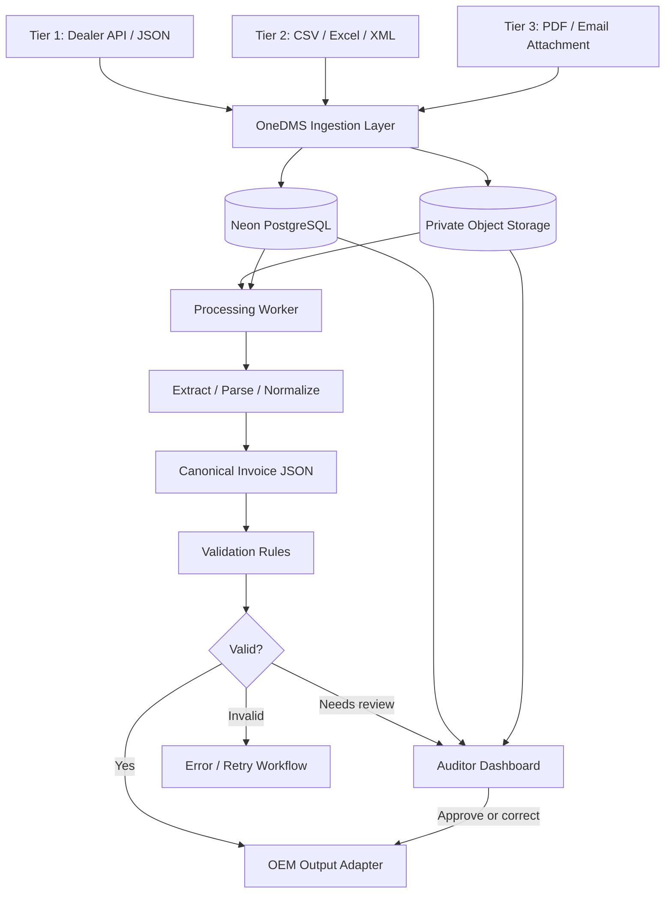
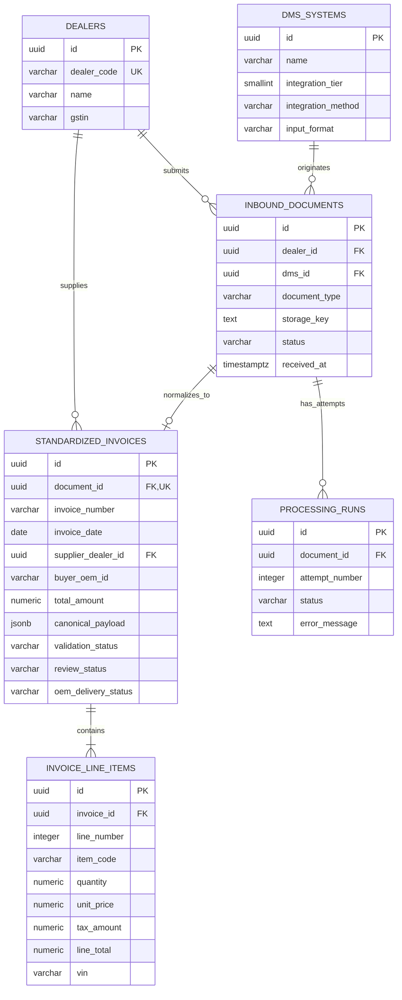
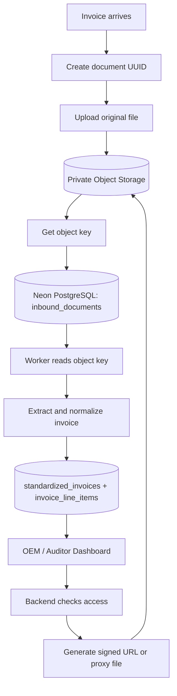

# OneDMS POC — Database Design

## 1. Purpose and scope

OneDMS is an interoperability layer between dealer management systems (DMSs) and the OEM (Daimler Truck). For this proof of concept, the scope is **invoice ingestion and standardization only**.

The POC should demonstrate that invoices arriving from two different DMSs and in different formats can be:
1. Received and tracked.
2. Stored in their original form for auditability.
3. Extracted and normalized into a canonical invoice representation.
4. Validated and flagged for human review when necessary.
5. Prepared for delivery to the OEM.

### Supported input tiers

| Tier | Typical dealer | Input | Processing |
|---|---|---|---|
| Tier 1 | Large | API / JSON | Parse payload directly; optionally retain raw payload |
| Tier 2 | Medium | CSV / Excel / XML | Store original file and parse structured content |
| Tier 3 | Legacy | PDF / email attachments | Store original file; extract using OCR/LLM, then validate |

All tiers converge on the same canonical invoice model. The POC does not replace the dealer's existing DMS.

## 2. Architecture overview



**Implementation note:** Neon PostgreSQL stores structured data and object references. Store original PDFs and uploaded files in object storage, not as binary data in relational tables. Use a private bucket and issue authorized, short-lived access URLs or proxy downloads through the backend.

Neon PostgreSQL does not automatically mean that object storage is available in every Neon project. Verify that the chosen Neon-integrated object-storage feature is available to your account; otherwise, use an external object store such as S3 or Cloudflare R2.

## 3. Tables at a glance

The POC uses six tables:

| Table | Responsibility |
|---|---|
| `dealers` | Dealer registry |
| `dms_systems` | DMS providers and supported integration/input types |
| `inbound_documents` | Tracks each received payload/file and points to its original stored object |
| `standardized_invoices` | Canonical, normalized invoice header and processing/review/delivery status |
| `invoice_line_items` | Individual invoice lines |
| `processing_runs` | Extraction/normalization attempts, failures and retries |

The actual file contents live in object storage. The `inbound_documents` table stores the object key and metadata.

## 4. Table definitions

Types below are PostgreSQL types. Use UUIDs for primary and foreign keys. `TIMESTAMPTZ` is preferred for event timestamps.

### 4.1 `dealers`

One row per dealer known to the OEM.

| Column | Type | Constraints / notes |
|---|---|---|
| `id` | `UUID` | Primary key |
| `dealer_code` | `VARCHAR(50)` | Unique, not null; OEM-assigned code |
| `name` | `VARCHAR(255)` | Not null |
| `gstin` | `VARCHAR(20)` | Nullable; tax identifier where applicable |
| `created_at` | `TIMESTAMPTZ` | Not null, default `now()` |

### 4.2 `dms_systems`

Describes DMS products/systems that dealers use. Multiple dealers can use the same DMS. A dealer may use more than one DMS over time.

| Column | Type | Constraints / notes |
|---|---|---|
| `id` | `UUID` | Primary key |
| `name` | `VARCHAR(255)` | Not null |
| `integration_tier` | `SMALLINT` | Not null; POC values 1, 2, or 3 |
| `integration_method` | `VARCHAR(20)` | Example: `API`, `UPLOAD`, `EMAIL` |
| `input_format` | `VARCHAR(20)` | Example: `JSON`, `CSV`, `XLSX`, `XML`, `PDF` |

For a future production system, a DMS may support several input formats. For this POC, one representative format per configured integration is sufficient.

### 4.3 `inbound_documents`

An intake register for every received submission. Use one row per received file or API submission. The original file is not stored in this table.

| Column | Type | Constraints / notes |
|---|---|---|
| `id` | `UUID` | Primary key |
| `dealer_id` | `UUID` | Not null; FK → `dealers.id` |
| `dms_id` | `UUID` | Not null; FK → `dms_systems.id` |
| `document_type` | `VARCHAR(30)` | Not null; use `INVOICE` for this POC |
| `original_file_name` | `TEXT` | Nullable for API submissions |
| `mime_type` | `VARCHAR(100)` | Nullable |
| `file_size_bytes` | `BIGINT` | Nullable |
| `storage_provider` | `VARCHAR(30)` | Nullable for API-only submissions |
| `storage_key` | `TEXT` | Nullable for API-only submissions; object key/asset ID, not a temporary URL |
| `checksum_sha256` | `VARCHAR(64)` | Nullable; useful for duplicate detection |
| `received_at` | `TIMESTAMPTZ` | Not null, default `now()` |
| `status` | `VARCHAR(30)` | Not null; e.g. `RECEIVED`, `PROCESSING`, `COMPLETED`, `FAILED` |

For Tier 1 API submissions, raw JSON can be retained in a JSONB column or stored as an object when raw-payload audit requirements justify it. Avoid uploading every API request as a file unless there is a reason.

### 4.4 `standardized_invoices`

The main canonical invoice header. It presents a consistent model regardless of the originating DMS.

| Column | Type | Constraints / notes |
|---|---|---|
| `id` | `UUID` | Primary key |
| `document_id` | `UUID` | Not null, unique; FK → `inbound_documents.id` |
| `invoice_number` | `VARCHAR(100)` | Not null; invoice number from source |
| `invoice_date` | `DATE` | Not null |
| `supplier_dealer_id` | `UUID` | Not null; FK → `dealers.id` |
| `buyer_oem_id` | `VARCHAR(100)` | Not null; OEM entity identifier |
| `currency` | `VARCHAR(3)` | Not null; ISO currency code, e.g. `INR` |
| `subtotal` | `NUMERIC(14,2)` | Not null; before taxes |
| `tax_amount` | `NUMERIC(14,2)` | Not null |
| `total_amount` | `NUMERIC(14,2)` | Not null |
| `canonical_payload` | `JSONB` | Not null; full normalized representation and extensible fields |
| `validation_status` | `VARCHAR(30)` | Not null; `PENDING`, `VALID`, `INVALID`, `REVIEW_REQUIRED` |
| `review_status` | `VARCHAR(30)` | Not null; `NOT_REQUIRED`, `PENDING`, `APPROVED`, `REJECTED` |
| `oem_delivery_status` | `VARCHAR(30)` | Not null; `NOT_SENT`, `SENT`, `FAILED` |
| `created_at` | `TIMESTAMPTZ` | Not null, default `now()` |
| `updated_at` | `TIMESTAMPTZ` | Not null, default `now()` |

**Why both regular columns and `canonical_payload`?** Regular columns make filtering, indexing, validation and reporting straightforward. JSONB keeps less common or evolving fields flexible without adding new columns for every source-specific field.

**Relationship assumption:** This POC assumes one inbound document produces at most one invoice. If one file can contain multiple invoices, remove the unique constraint from `document_id` and model one document to many invoices.

### 4.5 `invoice_line_items`

One row per vehicle, part or other line item on an invoice.

| Column | Type | Constraints / notes |
|---|---|---|
| `id` | `UUID` | Primary key |
| `invoice_id` | `UUID` | Not null; FK → `standardized_invoices.id` |
| `line_number` | `INTEGER` | Not null; position in invoice |
| `item_code` | `VARCHAR(100)` | Nullable; product/part code |
| `description` | `TEXT` | Not null |
| `quantity` | `NUMERIC(12,3)` | Not null |
| `unit_price` | `NUMERIC(14,2)` | Not null |
| `discount_amount` | `NUMERIC(14,2)` | Not null, default `0` |
| `taxable_amount` | `NUMERIC(14,2)` | Not null |
| `tax_rate` | `NUMERIC(5,2)` | Nullable |
| `tax_amount` | `NUMERIC(14,2)` | Not null |
| `line_total` | `NUMERIC(14,2)` | Not null |
| `vin` | `VARCHAR(17)` | Nullable; applicable to vehicle lines |

Add `UNIQUE (invoice_id, line_number)`. VIN is nullable because spare-parts invoices generally do not identify a vehicle per line. Do not assume the invoice line total formula without confirming whether tax and discounts are included in the source's line total definition.

### 4.6 `processing_runs`

One row per processing attempt. This supports retries and basic debugging.

| Column | Type | Constraints / notes |
|---|---|---|
| `id` | `UUID` | Primary key |
| `document_id` | `UUID` | Not null; FK → `inbound_documents.id` |
| `attempt_number` | `INTEGER` | Not null |
| `model_name` | `VARCHAR(100)` | Nullable; model used, if any |
| `status` | `VARCHAR(20)` | Not null; `RUNNING`, `SUCCESS`, `FAILED` |
| `error_message` | `TEXT` | Nullable |
| `started_at` | `TIMESTAMPTZ` | Not null, default `now()` |
| `completed_at` | `TIMESTAMPTZ` | Nullable |

Add `UNIQUE (document_id, attempt_number)`. Avoid storing API keys, credentials, or full sensitive invoice contents in error messages.

## 5. Entity-relationship diagram



### Relationship summary

- One dealer can submit many inbound documents.
- One DMS system can originate many inbound documents.
- Each inbound document belongs to one dealer and one source DMS.
- One inbound document produces zero or one standardized invoice in the POC.
- One standardized invoice contains one or more line items (once successfully parsed).
- One inbound document can have multiple processing runs.

## 6. Object storage design

### What belongs where?

| Data | Store in |
|---|---|
| Dealer records, invoice headers, line items, statuses | Neon PostgreSQL |
| Original PDF invoices | Object storage |
| Original uploaded CSV / XLSX / XML files | Object storage |
| Raw API JSON | PostgreSQL JSONB or object storage, depending on audit/size needs |
| Extracted canonical invoice fields | PostgreSQL |
| Object key / provider / checksum / file metadata | `inbound_documents` in PostgreSQL |
| Signed, expiring download URL | Generate on demand; do not treat as a permanent reference |

### Bucket and object-key convention

Use one **private** bucket for the POC, for example `onedms-invoices`. A simple key convention is:

```text
onedms-invoices/
  dealer-001/<document-uuid>.pdf
  dealer-002/<document-uuid>.csv
  dealer-002/<document-uuid>.xlsx
  dealer-003/<document-uuid>.pdf
```

Object stores typically treat these as object keys with slash-separated prefixes, not real directories. Do not create one bucket per dealer.

### Object-storage flow



**Reliability detail:** Uploads and database transactions cannot generally be committed atomically across both systems. Handle failures explicitly: if the upload succeeds but the DB write fails, delete the orphaned object where possible or run a cleanup job. If the DB record is created first and the upload fails, mark the document as failed and retry or clean up the record.

### Security

- Keep the bucket private.
- Check the requesting user's authorization on the backend before granting file access.
- Use short-lived signed URLs or proxy file downloads through the backend.
- Do not store temporary signed URLs as permanent database values.
- Avoid logging sensitive invoice data.
- Retain originals according to the POC's agreed retention policy.

## 7. Example end-to-end invoice flow

1. Dealer A sends invoice JSON through an API; Dealer B uploads a PDF.
2. OneDMS identifies the dealer and DMS, creates an `inbound_documents` record, and stores original files in object storage when applicable.
3. A processing run is created in `processing_runs`.
4. Tier 1 JSON is parsed directly; the PDF is extracted using OCR/LLM.
5. Both inputs are mapped to the same canonical invoice fields.
6. The invoice header is stored in `standardized_invoices`; its lines are stored in `invoice_line_items`.
7. Validation checks required fields, amounts, currency, invoice references and applicable business rules.
8. Valid invoices can be prepared for OEM delivery. Invalid or uncertain results are flagged for human review.
9. The auditor dashboard shows normalized fields beside the original source file.
10. The processing and delivery statuses are updated.

## 8. POC validation rules

At minimum, validate:

- Required invoice number, invoice date, supplier dealer and buyer OEM.
- Supported currency and valid numeric values.
- Quantity, price, discounts and tax values are within sensible bounds.
- Invoice header totals reconcile with line totals and tax, subject to the source's documented calculation rules and rounding.
- Dealer identity matches a registered dealer.
- Duplicate submissions are flagged using source invoice identity and/or file checksum; a checksum alone should not automatically reject two legitimately distinct invoices.
- Uncertain OCR/LLM fields are flagged for review instead of silently accepted.

LLM output is untrusted input. Validate its structure and values with deterministic code; do not let the model itself decide that an invoice is financially correct.

## 9. Recommended indexes and constraints

For this POC, add only useful indexes:

- Unique index on `dealers(dealer_code)`.
- Index on `inbound_documents(dealer_id, received_at)`.
- Index on `inbound_documents(status)`.
- Unique index on `standardized_invoices(document_id)` for the one-document/one-invoice assumption.
- Index on `standardized_invoices(invoice_number, supplier_dealer_id)`.
- Index on `standardized_invoices(validation_status, review_status)`.
- Unique constraint on `invoice_line_items(invoice_id, line_number)`.
- Unique constraint on `processing_runs(document_id, attempt_number)`.

Do not use invoice number alone as a global unique key: different dealers may issue the same invoice number.

## 10. What is intentionally excluded?

To keep the POC easy to build, it does not yet include:

- User/role/permission tables.
- Separate audit-event history table.
- Separate mapping-rules/configuration tables.
- Separate tax-rule tables.
- Orders, quotations and negotiation lifecycle.
- Email mailbox synchronization state.
- Multiple invoices inside one uploaded file.
- Multi-OEM tenancy.

Add these only if the demo requires them or the implementation reveals a concrete need.

## 11. Suggested implementation order

1. Create `dealers` and `dms_systems`, and insert two demo dealers using different DMS configurations.
2. Create `inbound_documents` and set up private object storage.
3. Build an API endpoint for JSON and a file-upload endpoint for PDF/CSV/XLSX/XML.
4. Implement `processing_runs` and basic status transitions.
5. Implement canonical invoice extraction and normalization.
6. Persist invoice headers and line items.
7. Add deterministic validation and a basic review screen.
8. Show the original document next to the normalized invoice.
9. Add a mocked OEM output adapter for the demo.

**POC success criterion:** Two different source formats result in equivalent canonical invoice structures, with validation outcomes and a link back to each original source.
