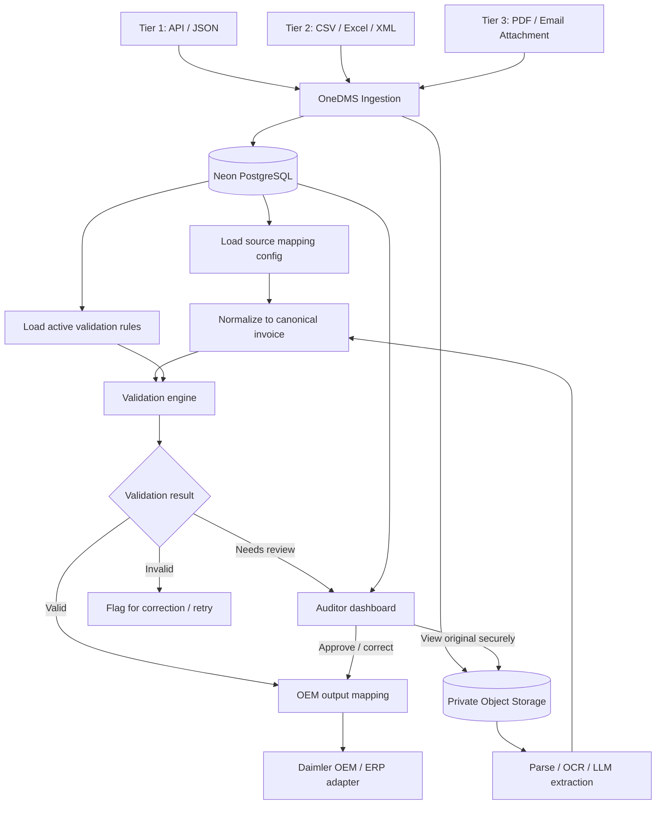
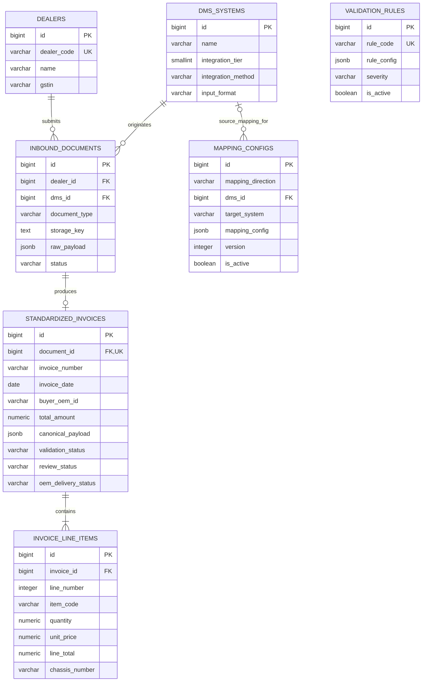
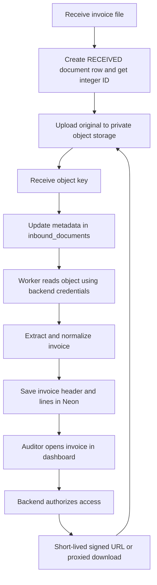

# OneDMS POC — Final Database Design

## 1. POC scope

OneDMS standardizes **invoices only** for the POC. Two or more dealers may use different DMS platforms and send invoices in different formats. OneDMS retains the source, maps each input into a common invoice structure, validates it, supports human review, and prepares the OEM output.

| Tier | Input | POC handling |
|---|---|---|
| Tier 1 — large dealers | API / JSON | Parse the payload directly; retain raw JSON when required for traceability |
| Tier 2 — medium dealers | CSV / Excel / XML | Store the source file in object storage and parse it |
| Tier 3 — legacy dealers | PDF / email attachment | Store the source file, extract fields with OCR/LLM, then validate |

**Final database scope: 7 tables.** The original files live in object storage, not PostgreSQL. The schema does not include order/quote workflows, user/role management, or a separate processing-attempt history because they are outside this invoice-only POC.

## 2. Architecture



The boxes describe logical components, not necessarily separate services. For the POC, ingestion, normalization and validation can run inside one backend application.

## 3. Final tables at a glance

| # | Table | Purpose |
|---:|---|---|
| 1 | `dealers` | Registry of dealers sending invoices |
| 2 | `dms_systems` | DMS provider/configuration identity and integration tier |
| 3 | `inbound_documents` | Tracks every received invoice submission and points to the original file when one exists |
| 4 | `mapping_configs` | Configurable inbound DMS-to-canonical mapping and canonical-to-OEM output mapping |
| 5 | `validation_rules` | Configurable invoice validation rules used by the rules engine |
| 6 | `standardized_invoices` | Canonical invoice header, totals and processing/review/delivery statuses |
| 7 | `invoice_line_items` | Canonical invoice line items |

## 4. Table definitions

Use PostgreSQL `BIGINT GENERATED BY DEFAULT AS IDENTITY` primary keys and `BIGINT` foreign keys, not UUIDs. Use `TIMESTAMPTZ` for event timestamps and `JSONB` for configuration/raw flexible payloads. Keep regular columns for fields queried or validated frequently. The database contains only these seven business tables, with no schema-version table.

### 4.1 `dealers`

One row per dealer.

| Column | Type | Rules / purpose |
|---|---|---|
| `id` | `BIGINT` | Generated identity PK |
| `dealer_code` | `VARCHAR(50)` | UNIQUE, NOT NULL; OEM dealer code |
| `name` | `VARCHAR(255)` | NOT NULL |
| `gstin` | `VARCHAR(20)` | Nullable; tax identifier when applicable |
| `created_at` | `TIMESTAMPTZ` | NOT NULL, default `now()` |

### 4.2 `dms_systems`

One row per DMS system/integration profile known to OneDMS. Multiple dealers can use the same DMS. Record the exact source DMS on each submission.

| Column | Type | Rules / purpose |
|---|---|---|
| `id` | `BIGINT` | Generated identity PK |
| `name` | `VARCHAR(255)` | NOT NULL |
| `integration_tier` | `SMALLINT` | NOT NULL; `1`, `2` or `3` |
| `integration_method` | `VARCHAR(20)` | NOT NULL; e.g. `API`, `UPLOAD`, `EMAIL` |
| `input_format` | `VARCHAR(20)` | NOT NULL; e.g. `JSON`, `CSV`, `XLSX`, `XML`, `PDF` |

For the POC, one representative input format per configured DMS profile is enough. A production DMS may need multiple supported formats/profiles.

### 4.3 `inbound_documents`

One row per received invoice file or API submission. Stores metadata and the object reference; it does not store PDF/Excel binaries.

| Column | Type | Rules / purpose |
|---|---|---|
| `id` | `BIGINT` | Generated identity PK |
| `dealer_id` | `BIGINT` | NOT NULL, FK → `dealers.id` |
| `dms_id` | `BIGINT` | NOT NULL, FK → `dms_systems.id` |
| `document_type` | `VARCHAR(30)` | NOT NULL; `INVOICE` for this POC |
| `original_file_name` | `TEXT` | Nullable for API submissions |
| `mime_type` | `VARCHAR(100)` | Nullable for API submissions |
| `file_size_bytes` | `BIGINT` | Nullable |
| `storage_key` | `TEXT` | Nullable for API-only submissions; object key/asset ID, not an expiring signed URL |
| `checksum_sha256` | `VARCHAR(64)` | Nullable; source file hash for duplicate checks |
| `raw_payload` | `JSONB` | Nullable; optional raw API JSON payload |
| `received_at` | `TIMESTAMPTZ` | NOT NULL, default `now()` |
| `status` | `VARCHAR(30)` | NOT NULL; `RECEIVED`, `PROCESSING`, `COMPLETED`, `REVIEW_REQUIRED`, `FAILED` |
| `error_message` | `TEXT` | Nullable; latest actionable processing error, with no secrets/sensitive full payloads |

**Storage rule:** If an actual file is received, upload it to the configured private object storage and save its `storage_key`. The provider is the same for every document and is configured once in the backend, not stored per row. For API JSON, use `raw_payload` if retaining the request body is needed; object storage is optional for API submissions.

### 4.4 `mapping_configs`

Stores both mapping directions so configuration is not hardcoded into the application:

- `SOURCE_TO_CANONICAL`: source field names/structures from a specific DMS → OneDMS canonical invoice fields.
- `CANONICAL_TO_OEM`: canonical invoice fields → the output structure expected by Daimler's target system.

| Column | Type | Rules / purpose |
|---|---|---|
| `id` | `BIGINT` | Generated identity PK |
| `mapping_name` | `VARCHAR(150)` | NOT NULL |
| `mapping_direction` | `VARCHAR(30)` | NOT NULL; `SOURCE_TO_CANONICAL` or `CANONICAL_TO_OEM` |
| `dms_id` | `BIGINT` | Nullable FK → `dms_systems.id`; required for `SOURCE_TO_CANONICAL`, null for `CANONICAL_TO_OEM` |
| `target_system` | `VARCHAR(100)` | Nullable; required for `CANONICAL_TO_OEM`, e.g. `DAIMLER_ERP` |
| `document_type` | `VARCHAR(30)` | NOT NULL; `INVOICE` for this POC |
| `mapping_config` | `JSONB` | NOT NULL; field paths, transformations and mapping options |
| `version` | `INTEGER` | NOT NULL, default `1` |
| `is_active` | `BOOLEAN` | NOT NULL, default `TRUE` |
| `created_at` | `TIMESTAMPTZ` | NOT NULL, default `now()` |

Add a check constraint so an inbound mapping must have `dms_id` and no `target_system`, while an OEM output mapping must have `target_system` and no `dms_id`. Keep only one active mapping per DMS/document type for inbound mapping, and one active mapping per target system/document type for OEM output. Older versions can remain inactive for traceability.

Example **inbound** `mapping_config`:

```json
{
  "invoice_number": "invoiceNo",
  "invoice_date": "billDate",
  "currency": "currencyCode",
  "total_amount": "grandTotal",
  "line_items": {
    "source_field": "items",
    "item_code": "sku",
    "quantity": "qty",
    "unit_price": "rate"
  }
}
```

Example **outbound** `mapping_config`:

```json
{
  "invoiceNumber": "invoice_number",
  "invoiceDate": "invoice_date",
  "supplierCode": "supplier_dealer_code",
  "currencyCode": "currency",
  "grossAmount": "total_amount"
}
```

These examples are illustrative: the exact field paths must match the sample DMS inputs and the OEM target specification. The mapping engine should use deterministic transformations where possible; an LLM is mainly useful for unstructured PDFs/emails.

### 4.5 `validation_rules`

Stores configurable rules for checking standardized invoices. The application executes these rules deterministically; JSON configuration describes the rule and its parameters.

| Column | Type | Rules / purpose |
|---|---|---|
| `id` | `BIGINT` | Generated identity PK |
| `rule_code` | `VARCHAR(80)` | UNIQUE, NOT NULL; e.g. `INVOICE_TOTAL_RECONCILIATION` |
| `rule_name` | `VARCHAR(200)` | NOT NULL |
| `document_type` | `VARCHAR(30)` | NOT NULL; `INVOICE` |
| `rule_config` | `JSONB` | NOT NULL; rule type, fields, tolerances or parameters |
| `severity` | `VARCHAR(20)` | NOT NULL; `ERROR` or `WARNING` |
| `is_active` | `BOOLEAN` | NOT NULL, default `TRUE` |
| `created_at` | `TIMESTAMPTZ` | NOT NULL, default `now()` |

Example `rule_config`:

```json
{
  "type": "TOTAL_RECONCILIATION",
  "subtotal_field": "subtotal",
  "tax_field": "tax_amount",
  "total_field": "total_amount",
  "tolerance": 0.01
}
```

Start with a few useful rules: required fields present, registered dealer, positive/valid quantities and prices, currency supported, header totals reconcile with line values/tax within an agreed rounding tolerance, and duplicate invoices flagged. The precise tax calculation must follow the real source/OEM rules; do not assume one universal formula.

### 4.6 `standardized_invoices`

One canonical invoice header per successfully parsed inbound document. Important fields are normal columns; `canonical_payload` preserves additional normalized fields without requiring a new column for every variation.

| Column | Type | Rules / purpose |
|---|---|---|
| `id` | `BIGINT` | Generated identity PK |
| `document_id` | `BIGINT` | NOT NULL, UNIQUE, FK → `inbound_documents.id` |
| `invoice_number` | `VARCHAR(100)` | NOT NULL; source invoice number |
| `invoice_date` | `DATE` | NOT NULL |
| `buyer_oem_id` | `VARCHAR(100)` | NOT NULL; OEM legal entity/identifier |
| `currency` | `VARCHAR(3)` | NOT NULL; ISO currency code, e.g. `INR` |
| `subtotal` | `NUMERIC(14,2)` | NOT NULL |
| `tax_amount` | `NUMERIC(14,2)` | NOT NULL |
| `total_amount` | `NUMERIC(14,2)` | NOT NULL |
| `canonical_payload` | `JSONB` | NOT NULL; complete normalized invoice representation / additional fields |
| `validation_status` | `VARCHAR(30)` | NOT NULL; `PENDING`, `VALID`, `INVALID`, `REVIEW_REQUIRED` |
| `review_status` | `VARCHAR(30)` | NOT NULL; `NOT_REQUIRED`, `PENDING`, `APPROVED`, `REJECTED` |
| `oem_delivery_status` | `VARCHAR(30)` | NOT NULL; `NOT_SENT`, `SENT`, `FAILED` |
| `created_at` | `TIMESTAMPTZ` | NOT NULL, default `now()` |
| `updated_at` | `TIMESTAMPTZ` | NOT NULL, default `now()` |

The sending dealer can be found through `document_id → inbound_documents.dealer_id`, so the same dealer ID is not redundantly stored on the invoice header. Do not make `invoice_number` globally unique: different dealers can issue the same number.

**POC assumption:** One inbound document contains at most one invoice. If one file can contain multiple invoices, change the `document_id` relationship to one inbound document → many standardized invoices.

### 4.7 `invoice_line_items`

One row per product, vehicle or part on an invoice.

| Column | Type | Rules / purpose |
|---|---|---|
| `id` | `BIGINT` | Generated identity PK |
| `invoice_id` | `BIGINT` | NOT NULL, FK → `standardized_invoices.id` |
| `line_number` | `INTEGER` | NOT NULL; position on source invoice |
| `item_code` | `VARCHAR(100)` | Nullable; product/part identifier |
| `description` | `TEXT` | NOT NULL |
| `quantity` | `NUMERIC(12,3)` | NOT NULL |
| `unit_price` | `NUMERIC(14,2)` | NOT NULL |
| `discount_amount` | `NUMERIC(14,2)` | NOT NULL, default `0` |
| `taxable_amount` | `NUMERIC(14,2)` | NOT NULL |
| `tax_rate` | `NUMERIC(5,2)` | Nullable |
| `tax_amount` | `NUMERIC(14,2)` | NOT NULL |
| `line_total` | `NUMERIC(14,2)` | NOT NULL |
| `chassis_number` | `VARCHAR(50)` | Nullable; identifies the exact truck for vehicle invoice lines; spare-parts lines may omit it |

Vehicle invoices should include a chassis number for each truck line. Keep the column nullable because spare-parts invoices do not always reference a specific vehicle. Apply vehicle-specific required-field validation using the line's category; do not make chassis numbers mandatory for every invoice line.

Add `UNIQUE (invoice_id, line_number)`. Apply the source/OEM definition for line totals consistently; do not assume whether tax or discounts are included without confirming the invoice convention.

## 5. Entity relationship diagram



`VALIDATION_RULES` applies by document type and active status; it intentionally has no foreign key to an invoice because rules are shared configuration. `MAPPING_CONFIGS` with `mapping_direction = 'CANONICAL_TO_OEM'` has a null `dms_id` and identifies its destination using `target_system`.

## 6. Object storage

### What is stored where?

| Data | Location |
|---|---|
| Dealer and DMS registry | Neon PostgreSQL |
| Source-to-canonical and canonical-to-OEM maps | `mapping_configs` in Neon |
| Validation configuration | `validation_rules` in Neon |
| Invoice headers, lines and statuses | Neon PostgreSQL |
| Original PDFs, CSVs, Excel and XML files | Private object storage |
| Optional raw API JSON | `inbound_documents.raw_payload` (or object storage if justified) |
| Object key/checksum and file metadata | `inbound_documents` in Neon |
| Shared storage provider, endpoint and bucket | Backend environment configuration |

Use one private bucket for the POC, for example `onedms-invoices`. Example object keys:

```text
onedms-invoices/dealer-001/<document-id>.pdf
onedms-invoices/dealer-002/<document-id>.csv
onedms-invoices/dealer-002/<document-id>.xlsx
onedms-invoices/dealer-003/<document-id>.pdf
```

These are object-key prefixes, not necessarily real directories. Do not create one bucket per dealer. Keep the shared Neon Object Storage provider, endpoint and bucket in backend configuration; store only the permanent object key on each document. Confirm Object Storage is available in the project before receiving files.

### Secure file access flow



Keep the bucket private. Do not persist expiring signed URLs as the file reference; generate one after checking the user's authorization. Handle partial failures: if upload succeeds but the database write fails, retry or clean up the orphaned object; if the database record is created but upload fails, mark the document failed and retry/clean it up.

## 7. Minimal indexes and constraints

- `UNIQUE (dealers.dealer_code)`.
- Index `inbound_documents(dealer_id, received_at)` and `inbound_documents(status)`.
- `UNIQUE (standardized_invoices.document_id)` for the one-document/one-invoice POC assumption.
- Index `standardized_invoices(invoice_number, validation_status)`; use dealer/source context when checking for duplicates.
- `UNIQUE (invoice_line_items.invoice_id, line_number)`.
- `UNIQUE (mapping_configs.dms_id, document_type, version)` where appropriate for inbound maps; add a separate partial unique index to ensure only one active inbound map per DMS/document type.
- Add a partial unique index to ensure only one active OEM output map per target system/document type.
- `UNIQUE (validation_rules.rule_code)`.

## 8. POC processing sequence

1. Register two dealers and their source DMS profiles.
2. Configure one active inbound mapping per DMS and one active canonical-to-OEM output mapping.
3. Receive an API payload or uploaded invoice file; create an `inbound_documents` row and store file inputs in private object storage.
4. Parse structured formats directly; use OCR/LLM extraction only for unstructured PDFs/email attachments.
5. Apply the configured source mapping and produce the canonical invoice header and line items.
6. Load active `validation_rules` and validate required fields, quantities, totals and duplicate candidates.
7. Set validation/review status. Human review is required for uncertain or invalid results; do not silently accept uncertain LLM extraction.
8. Apply the OEM output mapping and send/export the standardized invoice. Update `oem_delivery_status`.
9. In the auditor dashboard, show normalized data beside the original invoice using authorized file access.

## 9. Explicitly out of scope

Do not add these tables for the current POC unless the demo requirements change:

- Users, roles and permissions.
- Separate processing-attempt history (use `inbound_documents.status` and `error_message` for the initial demo).
- Orders, quotations, negotiation rounds or delivery lifecycle.
- Separate tax master tables or product catalog.
- Separate file table or bucket per file type.
- A separate audit-event history table.

**POC success criterion:** Two differently structured dealer invoices are converted into the same canonical invoice shape, checked against configurable rules, mapped to the OEM output shape, and traceable to their original input.
