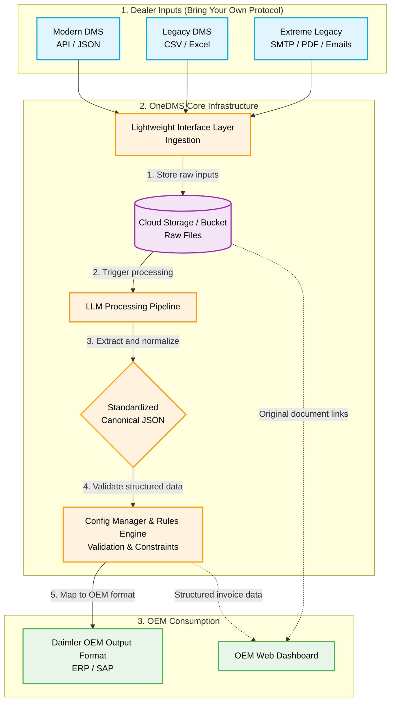
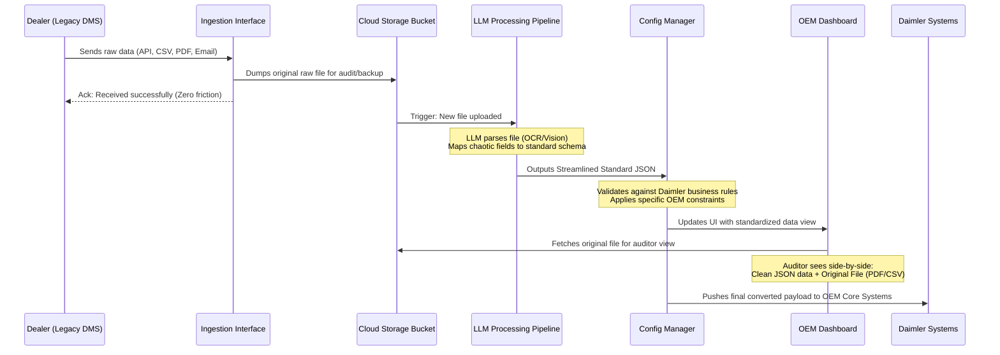

# OneDMS: Intelligent Middleware Architecture

This document outlines the high-level architecture and data workflow for the OneDMS standardization layer.

## 1. High-Level Architecture

The system acts as a universal bridge between fragmented dealer systems and the Daimler OEM. It utilizes a cloud bucket for immutable raw storage and an LLM-powered pipeline for intelligent data standardization.

## 2. Detailed Data Workflow (Sequence)

This sequence diagram illustrates the lifecycle of a single data transmission (e.g., a PDF invoice sent via email or a CSV upload) through the OneDMS pipeline.

## 3. Core Component Breakdown

1. **Lightweight Interface Layer:** A simple, unopinionated gateway accepting multiple protocols (REST API, Web Upload UI, SMTP/Email listeners). It does no processing; it only authenticates and routes the data.
2. **Cloud Storage / Bucket:** The single source of truth for all raw data. Every incoming file (JSON payload, CSV, Excel, PDF) is saved here identically before any processing begins. This guarantees no data is ever lost and provides a perfect audit trail.
3. **LLM Processing Pipeline:** The "Magic" layer. Instead of maintaining 80 different hardcoded parsers, we use an LLM (e.g., Gemini) to extract meaning from the raw files in the bucket and structure it into a unified, streamlined JSON schema.
4. **Config Manager & Rules Engine:** The gateway to Daimler. The LLM output goes here first. This component ensures the JSON meets strict constraints, applies business logic (e.g., checking if part numbers exist, validating formatting), and converts the standard JSON into the precise final format that Daimler's legacy ERPs expect.
5. **OEM Dashboard:** A modern UI that consumes data from the Config Manager. Crucially, it also links back to the **Cloud Bucket**, allowing Daimler auditors to view the exact original email, Excel, or PDF alongside the AI-extracted, standardized data.
